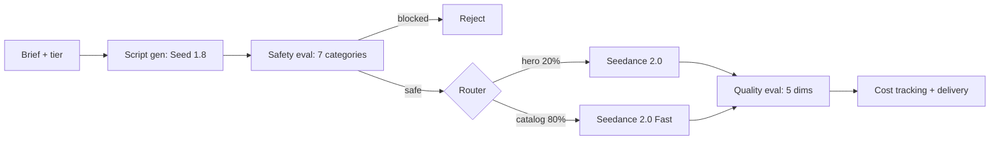

# SeedCamp

**Open-source reference architecture for AI video generation at scale.** Fork it, adapt it, ship it.

[](https://github.com/suboss87/SeedCamp2.0/actions/workflows/ci.yml) [](LICENSE) [](https://www.python.org/) [](https://seed.bytedance.com/en/seedance2_0) [](#deploy-anywhere)

> **April 2026:** [Seedance 2.0](https://seed.bytedance.com/en/seedance2_0) is now in public beta, ranked #2 on Artificial Analysis with native audio and 15s multi-shot. [Sora shuts down April 26.](docs/MIGRATE_FROM_SORA.md) SeedCamp ships with Seedance 2.0 model IDs and a migration path from Sora.

---

## What is SeedCamp?

SeedCamp is an open-source Python codebase that handles the hard parts of generating AI videos at scale. You give it a product brief and a tier (premium or standard), and it handles the rest: writing the script, checking for unsafe content, picking the right model, generating the video, tracking the cost, and managing failures.

It is not a managed service or a SaaS product. It is a reference architecture: a working system you can study, fork, and adapt for your own use case.

**The problem:** Generating one AI video is simple. Generating thousands is an engineering project. You need to handle:

- **Waiting and retrying** when the API is busy or fails
- **Routing** your best products to a premium model and the rest to a cheaper one
- **Tracking costs** so you know exactly what you are spending per video
- **Blocking unsafe content** before it wastes your budget
- **Running many jobs at once** without overwhelming the API or your budget

Most teams spend 2-3 weeks building this infrastructure from scratch. SeedCamp gives you a tested, documented starting point.

```python
from app.services.pipeline import run_pipeline
from app.services.video_gen import wait_for_video
from app.models.schemas import SKUTier

result = await run_pipeline(
    sku_id="SUV-001",
    brief="Luxury SUV on mountain pass at golden hour, cinematic walkaround",
    sku_tier=SKUTier.hero,
)
# Pipeline returns a task_id; poll until the video is ready
video = await wait_for_video(result["task_id"], result["model_id"])
print(video.video_url, result["cost"].total_cost_usd)
```

---

## Who is this for?

**Use SeedCamp if you:**

- Need to generate 100+ videos and want the infrastructure handled for you
- Are building a custom video pipeline and want a head start instead of starting from scratch
- Evaluated managed platforms (Shotstack, Oxolo, Creatify) but need more control or lower cost
- Want to learn how production-grade AI pipelines are structured
- Are migrating from Sora and need a working alternative on Seedance 2.0

**Use something else if you:**

- Need fewer than 50 videos. Just call the [ModelArk API](https://docs.byteplus.com/en/docs/ModelArk/1399008) directly. SeedCamp would be overkill.
- Want a managed service with a visual editor. Try [Shotstack](https://shotstack.io), [Oxolo](https://oxolo.com), or [Creatify](https://creatify.ai).
- Want to use multiple AI providers (Runway, Kling, Veo) today. Try [Vercel AI Gateway](https://vercel.com/docs/ai-gateway/capabilities/video-generation). SeedCamp works with BytePlus only for now; multi-provider support is on the [v1.1 roadmap](https://github.com/suboss87/SeedCamp2.0/issues/1).
- Need template-based video where you swap product images into a pre-made layout. That is a different problem.

---

## The 5 patterns

Every pattern is self-contained, tested, and reusable in any AI pipeline, not just video.

| Pattern | What it does | Why it matters | Code |
|---|---|---|---|
| **Smart Routing** | Sends important items to the best model, everything else to a cheaper one | Saves 30-40% on blended cost without sacrificing quality where it counts | [`model_router.py`](app/services/model_router.py) |
| **Async Pipeline** | Submits video jobs and waits for results with timeouts | The API does not return videos instantly; you need to poll and handle delays | [`video_gen.py`](app/services/video_gen.py) |
| **Cost Tracking** | Logs the exact cost of every video, broken down by model and tier | Know what you are spending before the invoice arrives | [`cost_tracker.py`](app/services/cost_tracker.py) |
| **Batch Processing** | Generates hundreds of videos concurrently with budget limits | Prevents runaway spending and handles individual failures gracefully | [`batch_generator.py`](app/services/batch_generator.py) |
| **Retry Logic** | Automatically retries failed requests with increasing wait times | APIs fail sometimes; retrying correctly is the difference between 95% and 99.9% success | [`retry.py`](app/utils/retry.py) |

Also included: a **safety evaluator** that blocks inappropriate content before generation, **quality scoring** that rates every video on 5 dimensions, a **Streamlit dashboard** for visual management, a **FastAPI server** with health checks and metrics, and **deploy configs** for 7 platforms.

---

## Quickstart

```bash
git clone https://github.com/suboss87/SeedCamp2.0.git && cd SeedCamp2.0
make install

# Try the full pipeline without an API key (dry-run simulates all API calls)
DRY_RUN=true make dev    # API on :8000, dashboard on :8501
```

When ready for real generation, [get an ARK_API_KEY](https://www.byteplus.com/en/product/modelark) and add it to `.env`.

```bash
python3 docs/examples/generate_single_video.py   # one video
python3 docs/examples/automotive_dealer.py       # 10 vehicles, tiered routing
python3 docs/examples/ecommerce_catalog.py       # 100 SKUs, batch with cost cap
```

---

## Architecture



Safety evaluation is **blocking**: if content is flagged as unsafe, generation stops before spending any credits. Quality evaluation is **non-blocking**: every video gets a quality score, but generation is not stopped for low scores.

| Step | Technology |
|---|---|
| 1. Input | FastAPI + Streamlit dashboard |
| 2. Script generation | Seed 1.8 via ModelArk |
| 3. Safety classification | Seed 1.8, 7 categories with scores |
| 4. Model routing | Pure function, configurable per tier |
| 5. Video generation | Seedance 2.0 or 2.0 Fast, async polling |
| 6. Quality evaluation | Seed 1.8, 5-dimension scoring |
| 7. Cost accounting | In-memory (single worker) or Firestore |

---

## Adapt for your vertical

The tier system is a simple enum. Changing it takes three lines.

```python
# Automotive: certified pre-owned to premium, aged stock to fast
class VehicleTier(str, Enum):
    featured = "featured"      # routes to Seedance 2.0
    inventory = "inventory"    # routes to Seedance 2.0 Fast

# E-commerce: best sellers to premium, long tail to fast
class ProductTier(str, Enum):
    hero = "hero"              # routes to Seedance 2.0
    catalog = "catalog"        # routes to Seedance 2.0 Fast
```

| Vertical | Hero tier | Catalog tier | Scale |
|---|---|---|---|
| **Automotive** | Certified, new arrivals | Wholesale, aged stock | 300-500K vehicles |
| **E-commerce** | Top 20% revenue SKUs | Long-tail catalog | 1K-100K SKUs |
| **Ad creative** | Campaign hero spots | Social cutdowns | 100-10K assets |

---

## Migrating from Sora?

Sora shuts down April 26 (app) and September 24 (API). If you have a Sora integration, SeedCamp is a drop-in path to Seedance 2.0.

```python
# Before: Sora (deprecated)
response = openai.videos.generate(prompt=brief, model="sora-2")

# After: SeedCamp on Seedance 2.0
result = await run_pipeline(sku_id="x", brief=brief, sku_tier=SKUTier.hero)
```

Seedance 2.0 is roughly 10x cheaper per second than Sora 2 Pro, ranks higher on Artificial Analysis (#2 vs absent), and generates audio natively.

Full migration guide: [docs/MIGRATE_FROM_SORA.md](docs/MIGRATE_FROM_SORA.md)

---

## Deploy anywhere

| Platform | Guide | Setup |
|---|---|---|
| **Local** | `make dev` | No Docker needed |
| **Docker** | [`deploy/docker/`](deploy/docker/) | `make docker-up` |
| **GCP Cloud Run** | [`deploy/gcp/`](deploy/gcp/) | Terraform |
| **AWS ECS Fargate** | [`deploy/aws/`](deploy/aws/) | Terraform |
| **BytePlus VKE** | [`deploy/byteplus/`](deploy/byteplus/) | K8s manifests |
| **Railway** | [`deploy/railway/`](deploy/railway/) | One-click |
| **Render** | [`deploy/render/`](deploy/render/) | One-click |

Before deploying publicly, read the [Security Checklist](docs/QUICKSTART.md#security-checklist-read-before-going-public). Set `API_KEY`, restrict `CORS_ORIGINS`, and put the Streamlit dashboard behind auth.

---

## Links

- [Quick Start](docs/QUICKSTART.md) - Railway, Render, Docker in 30 minutes
- [Deployment Guide](docs/DEPLOYMENT.md) - All platforms, step by step
- [Migrating from Sora](docs/MIGRATE_FROM_SORA.md) - Code diffs, pricing, timeline
- [Market Research](docs/market-research.md) - Data behind the positioning
- [API Reference](http://localhost:8000/docs) - Swagger UI (run locally)
- [Contributing](.github/CONTRIBUTING.md) - Good first issues labeled
- [Security](.github/SECURITY.md) - Vulnerability reporting

---

## Honest trade-offs

SeedCamp is a reference architecture, not a managed service. Here is what you should know before using it:

- **Works with BytePlus only, for now.** SeedCamp currently supports Seedance models through BytePlus ModelArk. Support for other providers (Runway, Kling, Veo) is planned for v1.1. Track progress in [issue #1](https://github.com/suboss87/SeedCamp2.0/issues/1).
- **Cost tracking resets if you restart the server.** The cost tracker stores data in memory by default. For persistent tracking across restarts, connect it to Firestore. A warning appears at startup if this could be a problem.
- **Tests use simulated API responses.** The 112-test suite verifies that the orchestration logic works correctly, but does not call real APIs. To test with real video generation, run the examples with a real `ARK_API_KEY`.
- **The safety filter can be too strict sometimes.** It uses an AI model to judge content safety, which means occasional false positives. You can adjust the sensitivity using `SAFETY_THRESHOLD_*` environment variables.
- **Seedance 2.0 is new.** The API entered public beta on April 14, 2026. Current limits are 2 requests per second and 3 concurrent tasks per account. These limits will increase over time.

---

Built by [Subash Natarajan](https://www.linkedin.com/in/subashn/) | Powered by [BytePlus ModelArk](https://www.byteplus.com/en/product/modelark) | MIT licensed
