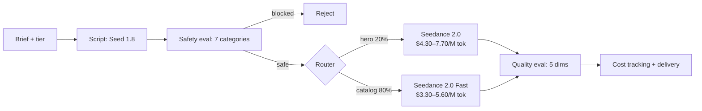

# SeedCamp

**Production-grade Python kit for generating AI video at scale.** Retry, routing, cost control, safety gates, and batch orchestration — the parts you don't want to rebuild.

[](https://github.com/suboss87/SeedCamp2.0/actions/workflows/ci.yml) [](LICENSE) [](https://www.python.org/) [](https://seed.bytedance.com/en/seedance2_0) [](#deploy-anywhere)

> **April 2026:** [Seedance 2.0](https://seed.bytedance.com/en/seedance2_0) just opened public beta (#2 on Artificial Analysis, native audio, 15s multi-shot). [Sora shuts down April 26](docs/MIGRATE_FROM_SORA.md). SeedCamp ships with Seedance 2.0 model IDs wired in, and a drop-in migration path from Sora.

---

## The 30-second pitch

You want to generate video from your app. You call the ModelArk API once — it works. You call it 10,000 times — you discover:

- the API is async, so you need polling with timeouts
- sometimes it 429s, so you need retry with `Retry-After`
- you want cheaper video for 80% of your catalog, so you need routing
- you need to track cost per request, so you need an accounting layer
- one bad prompt can burn $50 in failed generations, so you need safety gates
- you want to generate 500 videos concurrently without melting, so you need a semaphore with budget enforcement

That's 2-3 weeks of plumbing. **SeedCamp is that plumbing, already written.**

```python
from app.services.pipeline import run_pipeline
from app.models.schemas import GenerateRequest, SKUTier

# Route one hero SKU to Seedance 2.0 Standard (cinematic + audio).
result = await run_pipeline(GenerateRequest(
    sku_id="SUV-001",
    brief="Luxury SUV on mountain pass at golden hour, cinematic walkaround",
    sku_tier=SKUTier.hero,
))
print(result.video.url, result.cost.total_usd)  # → https://..., 0.0421
```

One pipeline, five production-grade patterns, seven deploy targets. Ready for Seedance 2.0 on day one.

---

## Why this matters (April 2026)

| Event | Impact |
|---|---|
| **Seedance 2.0 public beta** (Apr 14) | Top-2 video model is now accessible with an API key. Native audio ends the "AI video looks AI" problem. |
| **Sora shutdown** (Apr 26 app, Sep 24 API) | Every team with a Sora integration needs a migration path in ≤5 months. |
| **Cost gap widens** | Seedance 2.0 Fast is ~10x cheaper per second than Veo 3 and Runway Gen-4.5, and ranks above both. |

If you're shipping video in 2026, you're shipping on Seedance. SeedCamp gets you there in an afternoon instead of a sprint.

---

## What you get (the 5 patterns)

| Pattern | What it does | File | Lines |
|---|---|---|---|
| **Tiered Model Routing** | Send hero 20% to Seedance 2.0, catalog 80% to Fast — configurable per item | [`app/services/model_router.py`](app/services/model_router.py) | ~37 |
| **Async Task Pipeline** | Fire-and-forget generation with polling, timeout, status streaming via SSE | [`app/services/video_gen.py`](app/services/video_gen.py) | ~163 |
| **Cost Tracking** | Per-request token counting, per-tier attribution, Prometheus metrics | [`app/services/cost_tracker.py`](app/services/cost_tracker.py) | ~91 |
| **Batch Orchestration** | Semaphore-controlled concurrency, budget enforcement, error isolation per item | [`app/services/batch_generator.py`](app/services/batch_generator.py) | ~266 |
| **Retry with Backoff** | Exponential backoff, `Retry-After` honoring, structured error classification | [`app/utils/retry.py`](app/utils/retry.py) | ~210 |

Plus: **safety evaluation** (7-category content classifier with configurable block threshold), **quality gates** (5-dimension scoring, non-blocking), **Streamlit dashboard**, **FastAPI server** with `/metrics` and `/health`, **Docker/K8s/Render/Railway/GCP** deploy artifacts.

---

## Quickstart

```bash
git clone https://github.com/suboss87/SeedCamp2.0.git && cd SeedCamp2.0
make install

# Try the full pipeline without spending a cent (dry-run simulates all API calls)
DRY_RUN=true make dev    # API on :8000, dashboard on :8501
```

When you're ready for real generation, [get an `ARK_API_KEY`](https://www.byteplus.com/en/product/modelark) and drop it in `.env`.

```bash
python3 docs/examples/generate_single_video.py   # one video, ~$0.04
python3 docs/examples/automotive_dealer.py       # 10 vehicles, tiered routing
python3 docs/examples/ecommerce_catalog.py       # 100 SKUs, batch + cost cap
```

---

## Migrating from Sora?

OpenAI is shutting Sora down in stages — **app/web April 26, API September 24**. If you have a Sora integration, you have ≤5 months to migrate.

SeedCamp is the shortest path:

```python
# Sora (deprecated)
response = openai.videos.generate(prompt=brief, model="sora-2")

# SeedCamp on Seedance 2.0
result = await run_pipeline(GenerateRequest(sku_id="x", brief=brief, sku_tier=SKUTier.hero))
```

- **~10x cheaper** per second (Seedance 2.0 Fast vs Sora 2 Pro)
- **Higher ranked** on Artificial Analysis (Seedance 2.0 #2, Sora absent)
- **Native audio** — Sora added it late, Seedance 2.0 generates it jointly
- **No "Pro subscription" gate** — pay-per-use API

Full walkthrough: [**docs/MIGRATE_FROM_SORA.md**](docs/MIGRATE_FROM_SORA.md)

---

## Is SeedCamp for you?

**Use it if:**
- You're a developer integrating AI video into a product or pipeline
- You need >100 videos and don't want to rebuild retry/routing/cost tracking
- You want open-source (no vendor lock-in, no opaque enterprise tier)
- You're migrating from Sora and need a production-ready alternative
- You're building for inventory-scale: automotive, e-commerce, ad creative

**Don't use it if:**
- You need <10 videos — call the ModelArk API directly, SeedCamp is overkill
- You want template-based product video (use [Oxolo](https://oxolo.com) or [Creatify](https://creatify.ai))
- You need virtual tours / 3D walkthroughs (use [Matterport](https://matterport.com))
- You're locked to AWS Bedrock or Vertex AI — SeedCamp is ModelArk-native today

---

## Architecture



Safety eval is **blocking**. Quality eval is **non-blocking** (scores delivered alongside the video).

| Step | Technology |
|---|---|
| 1. Prompt | FastAPI + Streamlit dashboard |
| 2. Script gen | Seed 1.8 (via ModelArk) |
| 3. Safety classifier | Seed 1.8 with category + score output |
| 4. Route | Pure function, ~37 lines |
| 5. Video gen | Seedance 2.0 / 2.0 Fast, async polling |
| 6. Quality eval | Seed 1.8, 5-dimension scoring |
| 7. Cost accounting | In-memory (single-worker) or Firestore |

---

## Adapt for your vertical

Every vertical is a 3-line enum change.

```python
# Automotive — certified pre-owned → Seedance 2.0, aged stock → Fast
class VehicleTier(str, Enum):
    featured = "featured"      # → Seedance 2.0
    inventory = "inventory"    # → Seedance 2.0 Fast

# E-commerce — best sellers → Seedance 2.0, long tail → Fast
class ProductTier(str, Enum):
    hero = "hero"              # → Seedance 2.0
    catalog = "catalog"        # → Seedance 2.0 Fast
```

| Vertical | Hero tier | Catalog tier | Scale | Market proof |
|---|---|---|---|---|
| **Automotive** | Certified, new arrivals | Wholesale, aged stock | 300–500K vehicles | Phyron EUR 10M Series B, FT1000, 2,500 dealers |
| **E-commerce** | Top 20% revenue SKUs | Long-tail catalog | 1K–100K SKUs | Shopify: +86% conversion from product video |
| **Ad creative** | Campaign hero spots | Social cutdowns | 100–10K assets | Variant ad testing at scale |

*Real estate is served better by virtual tours (Matterport) — not SeedCamp's sweet spot.*

---

## Deploy anywhere

| Platform | Guide | Setup |
|---|---|---|
| **Local** | `make dev` | No Docker needed |
| **Docker** | [`deploy/docker/`](deploy/docker/) | `make docker-up` |
| **GCP Cloud Run** | [`deploy/gcp/`](deploy/gcp/) | Terraform |
| **AWS ECS Fargate** | [`deploy/aws/`](deploy/aws/) | Terraform |
| **BytePlus VKE** | [`deploy/byteplus/`](deploy/byteplus/) | K8s manifests |
| **Railway** | [`deploy/railway/`](deploy/railway/) | One-click |
| **Render** | [`deploy/render/`](deploy/render/) | One-click |

> **Before public deploy:** read the [Security Checklist](docs/QUICKSTART.md#security-checklist-read-before-going-public) — set `API_KEY`, tighten `CORS_ORIGINS`, put the Streamlit dashboard behind auth.

---

## Links

- **[Quick Start](docs/QUICKSTART.md)** — Railway, Render, Docker in 30 min
- **[Deployment Guide](docs/DEPLOYMENT.md)** — All platforms, step by step
- **[Migrating from Sora](docs/MIGRATE_FROM_SORA.md)** — Code diffs, pricing, checklist
- **[Market Research](docs/market-research.md)** — Data behind the positioning (April 2026)
- **[API Reference](http://localhost:8000/docs)** — Swagger UI (run locally)
- **[Contributing](.github/CONTRIBUTING.md)** — Good first issues labeled
- **[Security](.github/SECURITY.md)** — Vulnerability reporting (48h response)

---

## Honest trade-offs

SeedCamp is a reference architecture, not a managed service. A few things you should know:

- **Cost tracker is in-memory by default.** With `WORKERS>1` the `/api/cost-summary` endpoint returns partial data. Use a single worker (fine to ~10 RPS) or back it with Firestore. A startup warning fires when this situation is detected.
- **BytePlus ModelArk only, today.** Provider abstraction is on the roadmap (v1.1) — swap to Runway, Kling, or Veo without rewriting the pipeline. Track it in [issue #1](https://github.com/suboss87/SeedCamp2.0/issues).
- **Tests are mocked.** The test suite verifies orchestration logic in isolation. For end-to-end validation, run one of the examples with a real `ARK_API_KEY`.
- **Safety eval is LLM-as-judge.** False positives happen. Thresholds are configurable; see `SAFETY_THRESHOLD_*` env vars.

---

Built by [Subash Natarajan](https://www.linkedin.com/in/subashn/) · Powered by [BytePlus ModelArk](https://www.byteplus.com/en/product/modelark) · MIT licensed
